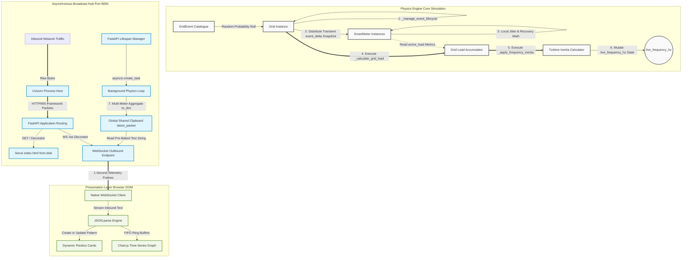

# GridStream Telemetry Dashboard

GridStream is a mock real-time grid stability simulation and monitoring dashboard designed for a UK substation operator. The system models live electrical grid physics, capturing high-frequency micro-fluctuations (jitter) and major fluctuations due to randomized grid events. The model simulates grid turbine momentum (inertia) alongside localized voltage-load coupling anomalies.

### Boot.dev Capstone Project
This project was built as the first non-guided personal project milestone on the [Boot.dev](https://www.boot.dev) curriculum. 
*   **Time Allocated**: Completed end-to-end within ~40 hours.
*   **Development Approach**: Since this project required combining national grid physics, asynchronous Python streaming, and frontend web development all at once, I used an AI-collaborative workflow to accelerate my research and learn these technologies.
*   **Code Ownership**: As you can see from the extensive commentary throughout the repository, I took the time to break down and understand every line of code to ensure full technical literacy over the entire stack.

Below is a 2-minute rolling GIF of the dashboard to give you flavour for the project.

***

<div align="center">
  
  <p><em>Real-Time Substation Monitoring Dashboard & Scrolling Timeline Chart</em></p>
</div>

### Learning Outcomes

Listed below are some of the new things that I learned during development of this project:

*   How to create alternative class constructors with the `@classmethod` decorator.
*   How to utilise **unittest.mock** to:
    *   isolate the class being tested without the need to instantiate objects from a different class. 
    *   deterministically unit test methods that utilise randomization.
*   Enumerate lists to make use of both index and value.

*   How to use Python modules like:
    *   **Uvicorn** to execute a server script and act as the mediator and translator for network traffic flowing between the client (browser) and server.
    *   **asyncio** to manage single-threaded CPU concurrent operations, enabling tasks to pause ('await') while others continue operating.
    *   **contextlib.asynccontextmanager** to structure a server lifespan into two phases (start-up and shutdown) with a yield, enabling clean startup and shutdown.
    *   **FastAPI framework**:
        *   to route network traffic from Uvicorn to specific server functions using path decorators.
        *   to execute server startup and shutdown tasks, even after a server crash during the post-startup yield.
        *   to orchestrate non-blocking concurrent tasks to stream assets (dashboard index.html) and live data to multiple client browsers simultaneously. 
        *   **FastAPI Websockets** to package network packets into interactable Python objects, enabling continuous bi-directional server-client interaction.

*   How to build a dynamic, real-time dashboard using HTML, CSS and JavaScript:
    *   **HTML**:
        *   Utilising block containers to define page layout.
        *   Utilizing inline containers to isolate and style specific elements.
    *   **CSS**:
        *   How to use flexbox engine to display elements (such as cards) side-by-side.
        *   How to define style selectors to style specific elements.
    *   **JavaScript**:
        *   Set up a Websocket object to receive data from a server script in real-time.
        *   Using a callback function to enable the browser to execute a function automatically upon receiving a websocket message.
        *   Converting received data packets into JSON objects and reading data from them using dot notation.
        *   Utilising the browser **Document Object Model (DOM)**:
            *   Using `document.getElementById` to locate specific elements on the web page so JavaScript can modify them dynamically.
            *   Using the Create or Update Pattern (`document.createElement`) to create new HTML elements only when they are missing.
            *   Using `.appendChild()` to attach dynamically created elements to parent containers.
            *   Updating layout views using `.innerText` to swap raw text strings and `.innerHTML` to inject nested HTML tags, modifying layout and text formatting.
        *   Utilising **Chart.js**:
            *   Using a `<canvas>` element and fetching its 2D drawing context (`.getContext("2d")`) to give Chart.js a rendering context.
            *   Configuring a line chart constructor and defining its Y-axis `min` and `max` bounds to prevent erratic chart auto-zooming.
            *   Building a 60-second First-In, First-Out (FIFO) ring buffer using `.push()` and `.shift()` on arrays to stream data to the chart smoothly without data overflow.

---

## System Architecture & Data Pipeline

The project implements a completely decoupled architecture using an asynchronous Python backend and a dynamic vanilla frontend.



---

## Key Features

*   **Grid Physics Simulation**: Models real-world metrics by balancing the global grid frequency against moving local station loads and linked voltage drops.
*   **Turbine Inertia Modeling**: Implements a mechanical dampening math formula that prevents data metrics from drifting away randomly, simulating how real physical generators lag under sudden network stress.
*   **Shared Clipboard Optimization**: Runs JSON serialization exactly once per second inside a single global background loop. This allows many browser tabs to connect and read data concurrently without loading down the CPU.
*   **Dynamic Substation Cards**: Employs a JavaScript Create or Update Pattern to build component cards in memory and attach them to the page layout automatically, bypassing the need to hardcode views.
*   **Algorithmic Line Colour Hashing**: Uses an HSL color wheel calculation combined with prime number mathematics to automatically assign widely dispersed line colours to the graph based on unique meter IDs.

---

## Tech Stack & Dependencies

*   **Core Backend**: Python 3.11+
*   **Server & Router**: FastAPI, Uvicorn, WebSockets, Asyncio
*   **Unit Testing Framework**: Native Python Standard Library `unittest`
*   **Test Automation**: Shell Script Automation (`test.sh`)
*   **Frontend Engine**: Semantic HTML5, CSS3 (Flexbox Engine), Vanilla ES6+ JavaScript
*   **Visualization Layer**: Chart.js 4.5.1 (Hardware-Accelerated Canvas Engine)
*   **Environment Control**: Virtual Environments (`.venv`), Pinned `requirements.txt`

---

## Getting Started

### Prerequisites
Ensure you have Python 3.11+ installed locally.

### 1. Set Up Sandbox Environment
Clone the repo and change directory to the repo root

```bash
# Initialize isolated Python environment
python -m venv .venv

# Activate environment (Linux/macOS)
source .venv/bin/activate

# Install pinned dependencies
pip install -r requirements.txt
```

### 2. Execute Automated Test Suites
Run the automation script to launch native test discovery across your simulation files:
```bash
# Ensure execution permissions are granted
chmod +x test.sh

# Run the test pipeline script
./test.sh
```

### 3. Launch the Telemetry Server
Boot up the backend application engine down single-channel port 8000:
```bash
uvicorn server:grid_api --reload
```
Once initialized, open your browser and navigate to **`http://localhost:8000`** to see the live dashboard.

## Future Roadmap

*   **Bidirectional Grid Control**: Introduce on-dashboard buttons to allow grid operators to manually trigger grid events (e.g. localized electric vehicle charging rushes).
*   **More data/charts!**:  Line graph showing global frequency over time; Total grid load bar chart that tells the operator if the grid is running at a power deficit (demand is high) or surplus (demand is low).
